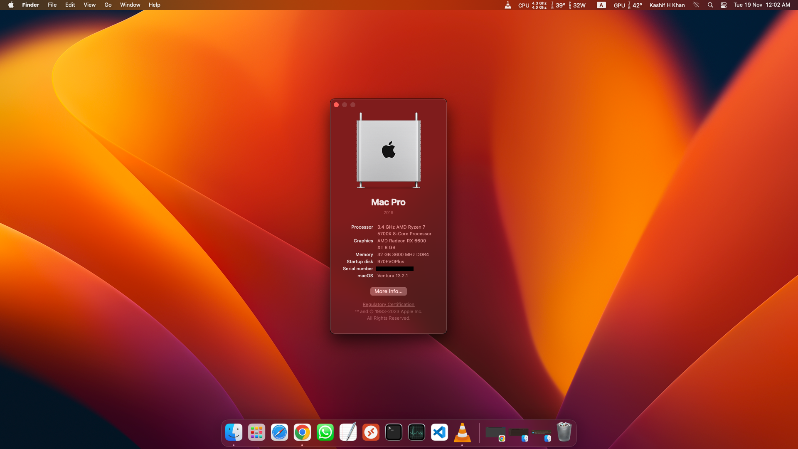
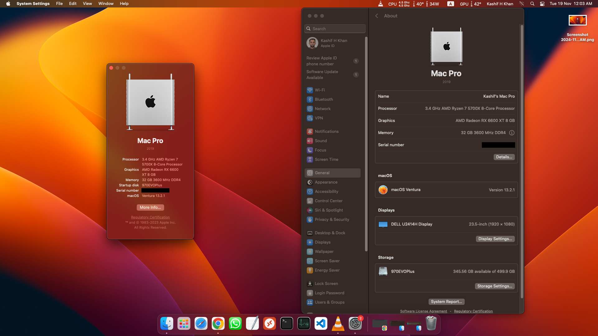
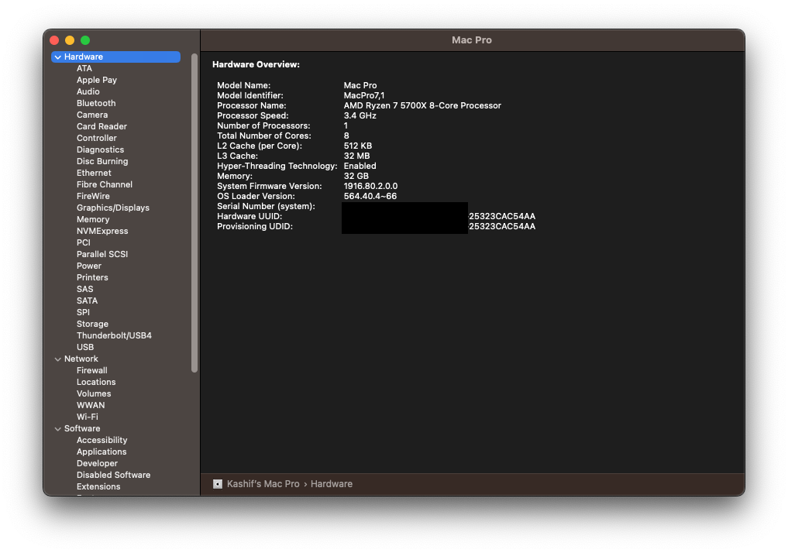
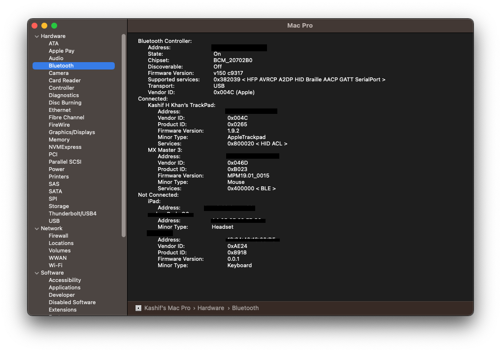
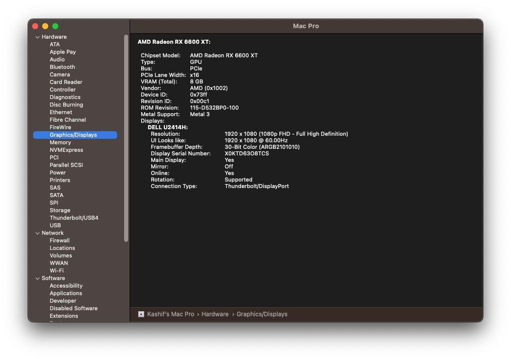

## Ryzen 7 5700x + RX 6600xt Ryzentosh (Macos Ventura) - OpenCore EFI

- Processor: AMD Ryzen 7 5700x
- Ram: 32GB ( Corsair Vengeance rgb rt 16GB x 2 - 3600MHz )
- Storage: 500GB ( Samsung SSD 970 EVO PLUS 500GB Gen3 )
- GPU: RX 6600 XT ( ROG Strix Radeon RX 6600 XT OC Edition 8GB GDDR6 )
- Motherboard: ASUS TUF GAMING B550M-PLUS WIFI II
- Power Supply: 750 Watt ( Corsair CX750F RGB CX-F Series ))
- LAN: Builtin works
- WLAN: Fenvi T919

Handoff + Airdrops Work!

`SMBIOS Used: MacPro7,1`
### Note: Please update the SMBIOS info.

## Screenshots

